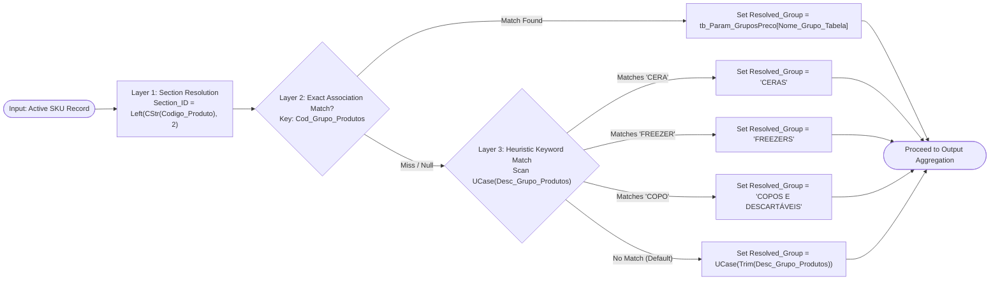

# SPECIFICATION: VBA Dynamic Price List Generator (ETL & Print-Ready Engine)
**File**: `spec-001.md`  
**Target Environment**: Microsoft Excel 2016+ / Microsoft 365 (VBA 7.1, 64-bit compatible)  
**Task for LLM/Coding Agent**: Implement a modular, high-performance VBA solution adhering strictly to the architecture, contracts, and algorithmic stages defined below.

---

## 1. OBJECTIVE & CONTEXT
Develop a production-grade VBA routine that extracts valid product and pricing data, normalizes grouping taxonomy across a 3-tier hierarchy (Section -> Exact Lookup -> Heuristic Fallback), and renders an ink-efficient, print-ready sales catalog formatted for paper distribution.

---

## 2. SYSTEM CONSTRAINTS & CODING STANDARDS
1. **Zero UI Blocking**: Wrap the entire execution block with state toggles (`ScreenUpdating`, `Calculation`, `EnableEvents`). Ensure an error-handling block restores application states in `Finally:` or on exit.
2. **In-Memory Operations Only**: Do **not** use cell-by-cell loops (`For Each Cell In Range...`). Read sources into memory arrays (`Variant`), process via hashtables (`Scripting.Dictionary`), and write output via single-shot block assignment (`Range.Resize.Value = OutputArray`).
3. **Strict Typing**: Include `Option Explicit` at the top of every module. Do not use generic `Variant` unless required for array assignments.
4. **Resilience & Auto-Provisioning**: If parameter/lookup sheets do not exist, create them dynamically with defaults rather than throwing unhandled exceptions.

---

## 3. DATA CONTRACTS & SOURCES

### Source 1: Product Master (`dProdutos`)
* **Sheet**: `Produtos`
* **Object Type**: `ListObject` named `dProdutos`
* **Required Columns**:
  * `Codigo_Produto` (Column 1 or lookup by header name)
  * `Descricao_Produto`
  * `Cod_Grupo_Produtos`
  * `Desc_Grupo_Produtos`
  * `Qtd_Padrao`

### Source 2: Price Matrix (`CfPcfic`)
* **Sheet**: `TabelaCustos`
* **Object Type**: `ListObject` named `CfPcfic`
* **Required Columns**:
  * `Código` (Acts as the inclusion filter: if SKU is not here, discard)
  * `P.Base - Ex IPI/ST` (Target price value)

### Parameter Source: Group Association (`tb_Param_GruposPreco`)
* **Sheet**: `Param_GruposPreco` (Auto-create if missing)
* **Object Type**: `ListObject` named `tb_Param_GruposPreco`
* **Columns**:
  * `Cod_Grupo_Produtos` (Integer/Long, Primary Key)
  * `Nome_Grupo_Tabela` (String, Target Display Name)

### Output Destination: Final Report (`TabelaPreco_Final`)
* **Sheet**: `Tabela_Preco` (Cleaned/overwritten on each execution)
* **Layout**: Categorized sections, formatted headers, printable area fitted to 1-page width.

---

## 4. TAXONOMY RESOLUTION ENGINE (ALGORITHM SPEC)

Every active SKU record (confirmed by presence in `CfPcfic`) must be processed through the following 3-tier waterfall resolution pipeline to determine its `Section_ID` and `Resolved_Group_Name`.

### 4.1. Execution Flowchart


---

## 5. ARCHITECTURAL BLUEPRINT (MODULE DECOMPOSITION)

The agent must structure the implementation into clear logical routines:

### Module 1: `mod_PriceList_Main`
* `Public Sub GeneratePriceList()`: Entry point. Orchestrates state management, timers, execution pipeline, and error recovery.

### Module 2: `mod_PriceList_Data`
* `Private Sub EnsureParameterSheetExists()`: Checks if sheet `Param_GruposPreco` and table `tb_Param_GruposPreco` exist. If not, creates sheet, injects headers, and formats as table.
* `Private Function LoadPriceIndex() As Object`: Reads `CfPcfic` into a `Scripting.Dictionary` (`Key = Codigo`, `Item = Preco_Venda`).
* `Private Function LoadAssociationIndex() As Object`: Reads `tb_Param_GruposPreco` into a `Scripting.Dictionary` (`Key = Cod_Grupo_Produtos`, `Item = Nome_Grupo_Tabela`).
* `Private Function ResolveGroupName(ByVal codGrupo As Variant, ByVal descGrupo As String, ByRef dictAssoc As Object) As String`: Executes Layer 2 and Layer 3 resolution logic.

### Module 3: `mod_PriceList_Renderer`
* `Private Sub RenderOutputSheet(ByRef outputData As Variant, ByVal rowCount As Long)`: Writes processed data array to sheet `Tabela_Preco`.
* `Private Sub ApplyPrintFormatting(ByVal targetWs As Worksheet, ByVal lastRow As Long)`:
  * Applies A4 Portrait, `FitToPagesWide = 1`, `FitToPagesTall = False`.
  * Sets `PrintTitleRows = "$1:$2"`.
  * Formats currency columns (`R$ #,##0.00`) and alignment (Code: Center, Description: Left, Qty: Center, Price: Right).
  * Injects visually distinct section break rows between differing target groups.

---

## 5. ARCHITECTURAL BLUEPRINT (MODULE DECOMPOSITION)

The agent must structure the implementation into clear logical routines:

### Module 1: `mod_PriceList_Main`
* `Public Sub GeneratePriceList()`: Entry point. Orchestrates state management, timers, execution pipeline, and error recovery.

### Module 2: `mod_PriceList_Data`
* `Private Sub EnsureParameterSheetExists()`: Checks if sheet `Param_GruposPreco` and table `tb_Param_GruposPreco` exist. If not, creates sheet, injects headers, and formats as table.
* `Private Function LoadPriceIndex() As Object`: Reads `CfPcfic` into a `Scripting.Dictionary` (`Key = Codigo`, `Item = Preco_Venda`).
* `Private Function LoadAssociationIndex() As Object`: Reads `tb_Param_GruposPreco` into a `Scripting.Dictionary` (`Key = Cod_Grupo_Produtos`, `Item = Nome_Grupo_Tabela`).
* `Private Function ResolveGroupName(ByVal codGrupo As Variant, ByVal descGrupo As String, ByRef dictAssoc As Object) As String`: Executes Layer 2 and Layer 3 resolution logic.

### Module 3: `mod_PriceList_Renderer`
* `Private Sub RenderOutputSheet(ByRef outputData As Variant, ByVal rowCount As Long)`: Writes processed data array to sheet `Tabela_Preco`.
* `Private Sub ApplyPrintFormatting(ByVal targetWs As Worksheet, ByVal lastRow As Long)`:
  * Applies A4 Portrait, `FitToPagesWide = 1`, `FitToPagesTall = False`.
  * Sets `PrintTitleRows = "$1:$2"`.
  * Formats currency columns (`R$ #,##0.00`) and alignment (Code: Center, Description: Left, Qty: Center, Price: Right).
  * Injects visually distinct section break rows between differing target groups.

---

## 6. STEP-BY-STEP IMPLEMENTATION CHECKLIST FOR THE AGENT
1. [ ] Check early exit conditions: verify tables `dProdutos` and `CfPcfic` exist. Raise descriptive error if missing.
2. [ ] Initialize `dictPreco` (Dictionary) with `CompareMode = vbTextCompare` to avoid string casing mismatch on codes.
3. [ ] Dimension internal memory arrays dynamically:
   ```vb
   Dim rawProducts As Variant
   rawProducts = wsProd.ListObjects("dProdutos").DataBodyRange.Value
   ReDim processedRecords(1 To UBound(rawProducts, 1), 1 To 6)