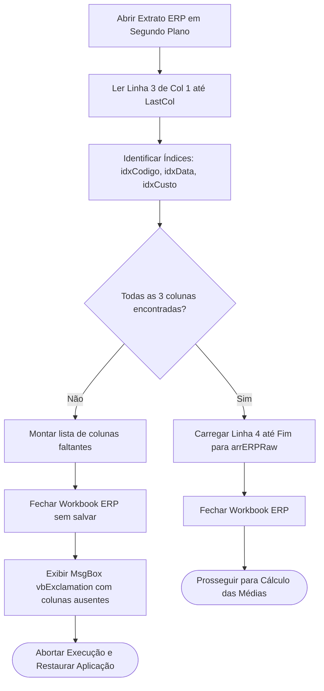

## 1. CONTEXT & ACCEPTANCE CRITERIA
### 1.1 Bussiness Context
Desenvolver 1 rotina de fechamento de custos que se especializa em calcular uma média móvel de custos por sku. Com base nos dados históricos de custos fornecidos por um relatório em formato '.xlsx', a rotina deverá salvar o resultado adicionando uma nova aba na planilha de banco de dados, situada em `/Users/icaro/Documents/CWS/Nano Cores/src/sheets/Cerulean_DB/database/Cerulean_DB_Custos.xlsx`.

### 1.2 Functional Requirements
- **RF-01 (Cálculo Médias Móveis):** Consumo do extrato ERP, associação pai/filho via taxonomia e cálculo das médias móveis com base em uma das quatro opções de snapshot em dias: última atualização, 30, 60, 90.

### 1.3 Acceptance Criteria (Definition of Done)
- [x] **Critério 1 (Equação Determinística de Média Móvel):** O custo médio apurado para qualquer produto ($A$) no período contratado deve coincidir estritamente com a média aritmética ponderada pelo volume de lançamentos válidos:

$$\text{Custo\_Medio\_SKU}_A = \frac{1}{c} \sum_{i=1}^{c} C_{A,i}$$

  **Dicionário dos Parâmetros da Equação:**
  | Variável | Definição Semântica | Tipo VBA / Restrição |
  | :---: | :--- | :--- |
  | $\text{Custo\_Medio\_SKU}_A$ | Custo médio individual final apurado para o produto $A$ | `Double` (arredondado para 2 casas decimais: `R$ #,##0.00`) |
  | $c$ | Cardinalidade total de lançamentos válidos do SKU no período | `Long` ($c = \text{Qtd\_Transacoes\_SKU}$) |
  | $C_{A,i}$ | Valor do custo gerencial registrado na $i$-ésima transação | `Double` extraído da coluna `Custo Gerencial` |
  | $\sum_{i=1}^{c} C_{A,i}$ | Somatório cumulativo dos custos transacionados na janela | Variável acumuladora (`Double`) |

  > **Tratamento de Indeterminação ($c = 0$):** Se o total de registros no período for nulo ($c = 0$), o motor é proibido de executar divisão; deve aplicar o valor sentinela $\text{Custo\_Medio\_SKU}_A = 0{,}00$, preservando o produto na matriz sem interrupção.
- [x] **Critério 2 (Performance):** Processar 10.000 SKUs em menos de 3,5 segundos (medido via `Timer` com CPU sem aceleração externa).
- [x] **Critério 3 (Persistência):** Todos os resultados devem persistir em uma tabela do banco de dados /Users/icaro/Documents/CWS/Nano Cores/src/sheets/Cerulean_DB/database/Cerulean_DB_Custos.xlsx`. Adicione uma nova aba a esta planilha sempre que a rotina for executada.
- [x] **Critério 4 (State Restoration):** Em caso de erro de divisão por zero, o Excel deve restaurar o cursor, eventos e cálculo automático imediatamente, abortar a rotina e disparar `Err.Raise` com mensagem descritiva apresentando o SKU causador do erro.
- [x] **Critério 5 (Precisão):** O custo final apurado deve respeitar a tolerância de no máximo duas casas decimais (R$ 0,00) por SKU.
- [x] **Critério 6 (Preservação Integral do Catálogo - Left Join Semântico):** Todo e qualquer produto catalogado no Cadastro Mestre (`Cadastro_Produtos`) deve obrigatoriamente constar no resultado, independentemente de possuir ou não movimentação no extrato de custos do ERP.
- [x] **Critério 7 (Tratamento de SKUs sem Histórico):** Para SKUs sem nenhum lançamento contábil no período analisado, o campo `Custo_Medio_SKU` deve ser renderizado como `0,00`, sem interromper a execução nem descartar a linha.
- [x] **Critério 8 (Clusterização Reflexiva de SKUs):** A família não é uma entidade abstrata; ela é identificada pelo próprio código do SKU Pai. O SKU Pai deve obrigatoriamente fazer parte do seu próprio cluster de cálculo. O cálculo do `Custo_Medio_Familia` deve ponderar/computar o conjunto unificado contendo o SKU Pai somado a todos os seus respectivos SKUs Filhos.
- [x] **Critério 9 (Tratamento de SKUs Desacompanhados / Órfãos):** Para qualquer produto do Cadastro Mestre que não possua vínculo na tabela de associações, o sistema deve assumir `Cod_Familia = Cod_Produto` e `Custo_Medio_Familia = Custo_Medio_SKU`.
- [x] **Critério 10 (Dynamic Header Schema Discovery & Tolerance):** O motor de ingestão do extrato ERP não deve depender de índices fixos de colunas. A rotina deve varrer horizontalmente todos os cabeçalhos da linha 3 e resolver dinamicamente as posições de: `Código`, `Data Atualização` e `Custo Gerencial`. Caso qualquer uma dessas três colunas obrigatórias não seja localizada, a execução deve ser imediatamente interrompida, restaurando os estados do Excel e exibindo uma mensagem de aviso (`vbExclamation`) listando expressamente quais colunas estão ausentes.

## 2. DATA CONTRACTS & SOURCES
### Input Contract 01: Product Parameters Association
* **Origin Path:** `/Users/icaro/Documents/CWS/Nano Cores/src/sheets/Cerulean_DB/database/Cerulean_DB_Parametros_Associacao_Produtos.xlsx`
* **Origin Entity:** Worksheet `Assoc_MediasMoveis`
* **Ingestion Method:** `ADODB.Connection` (Provider: `Microsoft.ACE.OLEDB.12.0; Extended Properties="Excel 12.0 Xml;HDR=YES;IMEX=1;"`)
* **SQL Query Definition:**
   ```sql
  SELECT [Cod_Pai], [Cod_Filho] 
  FROM [Assoc_MediasMoveis$] 
  WHERE [Cod_Pai] IS NOT NULL
   ```

* **Schema Specification:**
  | Coluna SQL | Tipo VBA | Papel no Contrato | Regra / Validação |
  | :--- | :--- | :--- | :--- |
  | `Cod_Pai` | `String` | Chave de Agrupamento | Converter para string limpa (`Trim$`) |
  | `Cod_Filho` | `String` | Membro / SKU Filho | Obrigatório; rejeitar registros vazios |

* **Post-Ingestion Lifecycle & In-Memory Target:**
  * **Destinos em Memória:** Criar dois dicionários complementares:
    1. `dictSKUToFamily` (`Scripting.Dictionary`):
       - Papel: Lookup direto $O(1)$ de qualquer SKU para o seu Pai representante.
       - Mapeamento: Inserir `Cod_Filho -> Cod_Pai` E TAMBÉM `Cod_Pai -> Cod_Pai` (garantia reflexiva).
    2. `dictFamilyClusters` (`Scripting.Dictionary`):
       - Papel: Armazenar a lista de todos os membros de cada família para iteração de cálculo.
       - Chave: `Cod_Pai` (`String`).
       - Item: `Scripting.Dictionary` contendo todas as chaves do cluster (`{Cod_Pai, Filho_1, Filho_2, ...}`).

* **Regra de Carga Algorítmica:**
  Ao iterar os registros de `Assoc_MediasMoveis`:
  - Se `Cod_Pai` ainda não existe em `dictFamilyClusters`, criar novo sub-dicionário e registrar o próprio `Cod_Pai` como membro número 1.
  - Registrar o `Cod_Filho` como membro subsequente dentro do mesmo cluster.
  - No `dictSKUToFamily`, registrar `dictSKUToFamily(Cod_Pai) = Cod_Pai` e `dictSKUToFamily(Cod_Filho) = Cod_Pai`.

* **Fallback & Fault Tolerance:**
  * Se houver `Cod_Filho` duplicado: sobrescrever com o último registro e logar no painel de debug.

---

### Input Contract 02: Product Master
* **Origin Path:** `/Users/icaro/Documents/CWS/Nano Cores/src/sheets/Cerulean_DB/database/Cerulean_DB_Produtos.xlsx`
* **Origin Entity:** Worksheet `Cadastro_Produtos`
* **Ingestion Method:** `ADODB.Connection` (Provider: `Microsoft.ACE.OLEDB.12.0; Extended Properties="Excel 12.0 Xml;HDR=YES;IMEX=1;"`)
* **SQL Query Definition:**
   ```sql
  SELECT [Código], [Descrição] 
  FROM [Cadastro_Produtos$] 
  WHERE ((Val([Código]) BETWEEN 40000 AND 45999) 
      OR (Val([Código]) BETWEEN 50000 AND 50999))
  AND [Ativo] = 'Sim'
   ```

* **Schema Specification:**
  | Coluna SQL | Tipo VBA | Papel no Contrato | Regra / Validação |
  | :--- | :--- | :--- | :--- |
  | `Código` | `String` | Chave | Converter para string limpa (`Trim$`) / NOT NULL |
  | `Descrição` | `String` | Valor | Converter para string limpa (`Trim$`) / Fallback: "Sem Descrição" |

* **Post-Ingestion Lifecycle & In-Memory Target:**
  * **Destino:** `Scripting.Dictionary` instanciado como `dictProductMaster`.
  * **Finalidade:** O número de chaves em `dictProductMaster` determina o dimensionamento exato da matriz de saída.
  * **Regra Mandatória:** O loop de renderização do relatório deve iterar sobre as chaves do dictProductMaster, nunca sobre as chaves do extrato de custos do ERP.

* **Fallback & Fault Tolerance:**
  * Se houver `Código` duplicado: sobrescrever com o último registro e logar no painel de debug.

---

### Input Contract 03: Extrato ERP
* **Ingestion Method:** `Application.FileDialog(msoFileDialogFilePicker)` with `AllowMultiSelect = False`.
* **Header Inspection Row:** Linha 3 (varredura horizontal de `Col = 1` até a última coluna preenchida).
* **Data Starting Row:** Linha 4 até a última linha preenchida.

* **Mandatory Columns Contract (Case-Insensitive & Trimmed):**
  | Nome Esperado | Papel no Contrato | Tipo Alvo VBA | Obrigatoriedade |
  | :--- | :--- | :--- | :--- |
  | `Código` | Chave do SKU | `String` | **Obrigatória** |
  | `Data Atualização` | Data Contábil / Snapshot | `Date` | **Obrigatória** |
  | `Custo Gerencial` | Custo Histórico Base | `Double` | **Obrigatória** |
  | `Descrição` | Texto Descritivo | `String` | Opcional (Usa `dictProductMaster`) |

* **Header Resolution Strategy:**
  1. Carregar a linha 3 para um vetor em memória.
  2. Mapear os índices das colunas encontradas: `idxCodigo`, `idxData`, `idxCusto`.
  3. Se `idxCodigo = 0` OU `idxData = 0` OU `idxCusto = 0`:
     - Compilar string com a lista dos nomes faltantes.
     - Fechar a pasta de trabalho externa sem salvar (`wbERP.Close SaveChanges:=False`).
     - Exibir caixa de diálogo clara para o usuário:
       *"Relatório ERP incompatível. As seguintes colunas obrigatórias não foram encontradas na linha 3: [Lista_Colunas_Faltantes]"*.
     - Abortar a rotina de forma limpa, acionando o bloco de restauração de tela (`FinallyBlock`).

---

### Output Contract 01: External Database Persistence (Cerulean_DB_Custos)
* **Destination Path:** `/Users/icaro/Documents/CWS/Nano Cores/src/sheets/Cerulean_DB/database/Cerulean_DB_Custos.xlsx`
* **Egress Mechanism:** Automação COM em segundo plano (`Excel.Application` com `Visible = False`, abertura via `Workbooks.Open(ReadOnly:=False)`).
* **Target Worksheet Dynamic Naming:**
  * Nome da aba gerada: 
    * Para períodos em dia: `Custo_MM_[Janela]D_YYYYMMDD_HHMM`
    * Para a última atualização: `Custo_MM_ULT_YYYYMMDD_HHMM`
  * Lógica no Motor de Cálculo (mod_CostEngine_Calculator):
    * Quando a opção for 30, 60 ou 90, o filtro aplica a data de corte cutoffDate = Date - windowDays.
    * Quando a opção for "Última Atualização", o motor agrupa por SKU e isola o registro com a maior Data Atualização presente na ingestão do ERP. Depois faz a média da família com base na última atualização para cada SKU.
  * Exemplo: `Custo_MM_90D_20261001_1430`
  * O nome deve refletir o parâmetro de dias escolhido (Última Atualização, 30, 60 ou 90) e o timestamp de execução.

* **Schema Specification (Output Array & Table Layout):**
  | Índice Matriz | Nome da Coluna | Tipo VBA | Formato Numérico | Origem dos Dados / Regra |
  | :---: | :--- | :--- | :--- | :--- |
  | Col 1 | `Cod_Produto` | `String` | `@` (Texto) | Chave extraída do `dictProductMaster` |
  | Col 2 | `Descricao_Produto` | `String` | `@` (Texto) | Descrição do `dictProductMaster` |
  | Col 3 | `Custo_Medio_SKU` | `Double` | `R$ #,##0.00` | Média calculada nos últimos $N$ dias (Fallback: `0.00`) |
  | Col 4 | `Custo_Medio_Familia` | `Double` | `R$ #,##0.00` | Média ponderada/aritmética da família calculada |
  | Col 5 | `Qtd_Transacoes_SKU` | `Long` | `#,##0` | Total de registros avaliados no período para o SKU |
  | Col 6 | `Janela_Dias_Base` | `String`| `0` | Parâmetro selecionado (Última Atualização, 30D, 60D ou 90D) |
  | Col 7 | `Data_Processamento` | `Date` | `yyyy-mm-dd hh:mm:ss` | Carimbo de data/hora da rotina (`Now`) |

* **Pre-Flush In-Memory Blueprint:**
  * **Dimensão da Matriz:** `ReDim outArray(1 To dictProductMaster.Count, 1 To 7) As Variant`.
  * **Alocação:** Populada sequencialmente pelo loop diretor do catálogo mestre.

* **Post-Processing & Raw Data Persistence:**
  1. Adicionar uma nova Worksheet ao final de `Cerulean_DB_Custos.xlsx`.
  2. Despejar a linha de cabeçalhos em `Range("A1:G1")`.
  3. Despejo em bloco único da matriz de dados: `Range("A2").Resize(dictProductMaster.Count, 7).Value2 = outArray`.
  4. Manter dados em formato bruto, sem estilização visual ou conversão de tabela, garantindo leitura limpa e de alta performance via SQL/ADO.

* **Fallback, Concurrency & Collision Policy:**
  * **File Lock Check:** Antes de iniciar a gravação, testar se `Cerulean_DB_Custos.xlsx` está aberto por outro processo/usuário na rede (`Open For Binary Access Read Write Lock Read Write`). Se travado, abortar imediatamente com `Err.Raise` e aviso de concorrência.
  * **Sheet Collision:** Se por qualquer motivo a aba com o timestamp já existir, adicionar sufixo incremental (`_v2`, `_v3`).
  * **Save and Close:** Salvar explicitamente (`wbDest.Close SaveChanges:=True`) e anular referências COM (`Set wbDest = Nothing`).

---

## 3. ALGORITHMIC PIPELINE (TAXONOMY RESOLUTION ENGINE)
### 3.1 Driving Loop Strategy (Left Join Resolution)
Para evitar a perda de SKUs inativos ou sem compras recentes:
1. **Estrutura Mestra:** A matriz de saída é orientada a partir do `dictProductMaster`.
2. **Resolução de Custos por Chave:**
   ```vba
   For Each skuKey In dictProductMaster.Keys
      parentCode = dictSKUToFamily(skuKey)
      
      outArray(i, 1) = skuKey                             ' Cod_Produto
      outArray(i, 2) = dictProductMaster(skuKey)          ' Descricao_Produto
      outArray(i, 3) = dictSKUAvg(skuKey)                 ' Custo_Medio_SKU
      outArray(i, 4) = dictFamilyAvg(parentCode)          ' Custo_Medio_Familia
      outArray(i, 5) = dictTxCount(skuKey)                ' Qtd_Transacoes_SKU
      outArray(i, 6) = windowParamLabel                   ' Janela_Dias_Base (ULT, 30D, 60D, 90D)
      outArray(i, 7) = Now                                ' Data_Processamento
   Next skuKey
   ```
---

### 3.2 Family Cluster Calculation Pipeline
O cálculo das famílias executa estritamente após a conclusão das médias individuais dos SKUs (`dictSKUAvg`):

#### Etapa 1: Resolução de Órfãos (Cadastro Mestre vs. Cluster)
Para cada código de SKU ou "skuCode" presente em `dictProductMaster`:
- Se `NOT dictSKUToFamily.Exists(skuCode)`:
  - Definir `dictSKUToFamily(skuCode) = skuCode`.
  - Criar entrada em `dictFamilyClusters(skuCode)` contendo apenas ele mesmo.

#### Etapa 2: Consolidação da Média do Cluster
Iterar sobre cada `parentKey` em `dictFamilyClusters`:
1. Inicializar `clusterSum = 0.0` e `clusterCount = 0`.
2. Para cada `memberSKU` dentro do cluster `dictFamilyClusters(parentKey)`:
   - Se `dictSKUAvg.Exists(memberSKU)` e `dictSKUAvg(memberSKU) > 0`:
     - `clusterSum = clusterSum + dictSKUAvg(memberSKU)`
     - `clusterCount = clusterCount + 1`
3. Apuração da métrica da família:
   ```vba
   If clusterCount > 0 Then
       dictFamilyAvg(parentKey) = Round(clusterSum / clusterCount, 2)
   Else
       dictFamilyAvg(parentKey) = 0#
   End If
   ```

---

### 3.3 Ingestion Pipeline: Dynamic ERP Schema Validation



---

### 3.4 Flowchart Média Móvel de 90 dias

```mermaid
  flowchart TD
  Start([Início: Ingestão arrERPRaw]) --> SetCutoff[Definir CutoffDate = Date - 90]
  SetCutoff --> LoopERP[Iterar Linhas de arrERPRaw]
  LoopERP --> CheckDate{Data >= CutoffDate?}
  CheckDate -- Sim --> AccSKU[Acumular Soma_Custos do SKU<br/>Incrementar Qtd_Transacoes do SKU]
  CheckDate -- Não --> NextRow{Há mais linhas no ERP?}
  AccSKU --> NextRow
  NextRow -- Sim --> LoopERP
  NextRow -- Não --> LoopMaster[Iterar SKUs em dictProductMaster]

  LoopMaster --> CheckTx{Qtd_Transacoes > 0?}
  CheckTx -- Sim --> CalcSKUAvg["dictSKUAvg(SKU) = Round(Soma / Qtd, 2)"]
  CheckTx -- Não --> FallbackZero["dictSKUAvg(SKU) = 0.00"]
  CalcSKUAvg --> NextMaster{Mais SKUs no Mestre?}
  FallbackZero --> NextMaster
  NextMaster -- Sim --> LoopMaster
  NextMaster -- Não --> LoopClusters[Iterar parentKey em dictFamilyClusters]

  LoopClusters --> InitCluster["clusterSum = 0.0<br/>clusterCount = 0"]
  InitCluster --> LoopMembers[Iterar memberSKU no Cluster]
  LoopMembers --> CheckMemberCost{"dictSKUAvg(memberSKU) > 0?"}
  CheckMemberCost -- Sim --> AccFamily["clusterSum += dictSKUAvg(memberSKU)<br/>clusterCount += 1"]
  CheckMemberCost -- Não --> NextMember{Mais membros no Cluster?}
  AccFamily --> NextMember
  NextMember -- Sim --> LoopMembers
  NextMember -- Não --> CheckCount{clusterCount > 0?}
  CheckCount -- Sim --> CalcFamilyAvg["dictFamilyAvg(parentKey) = Round(clusterSum / clusterCount, 2)"]
  CheckCount -- Não --> FallbackFamilyZero["dictFamilyAvg(parentKey) = 0.00"]
  CalcFamilyAvg --> NextCluster{Mais famílias?}
  FallbackFamilyZero --> NextCluster
  NextCluster -- Sim --> LoopClusters
  NextCluster -- Não --> EndPipe([Fim: Matriz Pronta para Persistência])
```



---

### 3.5 Flowchart Snapshot e Médias Entre Famílias

```mermaid
    flowchart TD
    StartSnapshot([Início: Ingestão arrERPRaw]) --> InitDicts["Inicializar dictLatestDate e dictLatestCost"]
    InitDicts --> LoopERPRows[Iterar Linhas de arrERPRaw]
    LoopERPRows --> CheckLatest{"Data > dictLatestDate(SKU)?"}
    CheckLatest -- Sim --> StoreLatest["dictLatestDate(SKU) = Data<br/>dictLatestCost(SKU) = Custo Gerencial"]
    CheckLatest -- Não --> NextERPRow{Há mais linhas no ERP?}
    StoreLatest --> NextERPRow
    NextERPRow -- Sim --> LoopERPRows
    NextERPRow -- Não --> LoopMasterSnap[Iterar SKUs em dictProductMaster]
    
    LoopMasterSnap --> CheckExists{"dictLatestCost.Exists(SKU)?"}
    CheckExists -- Sim --> AssignSnap["dictSKUAvg(SKU) = dictLatestCost(SKU)<br/>Qtd_Transacoes_SKU = 1"]
    CheckExists -- Não --> AssignZeroSnap["dictSKUAvg(SKU) = 0.00<br/>Qtd_Transacoes_SKU = 0"]
    AssignSnap --> NextMasterSnap{Mais SKUs no Mestre?}
    AssignZeroSnap --> NextMasterSnap
    NextMasterSnap -- Sim --> LoopMasterSnap
    NextMasterSnap -- Não --> LoopClustersSnap[Iterar parentKey em dictFamilyClusters]
    
    LoopClustersSnap --> InitClusterSnap["clusterSum = 0.0<br/>clusterCount = 0"]
    InitClusterSnap --> LoopMembersSnap[Iterar memberSKU no Cluster]
    LoopMembersSnap --> CheckMemberSnap{"dictSKUAvg(memberSKU) > 0?"}
    CheckMemberSnap -- Sim --> AccFamilySnap["clusterSum += dictSKUAvg(memberSKU)<br/>clusterCount += 1"]
    CheckMemberSnap -- Não --> NextMemberSnap{Mais membros no Cluster?}
    AccFamilySnap --> NextMemberSnap
    NextMemberSnap -- Sim --> LoopMembersSnap
    NextMemberSnap -- Não --> CheckCountSnap{clusterCount > 0?}
    CheckCountSnap -- Sim --> CalcFamilySnap["dictFamilyAvg(parentKey) = Round(clusterSum / clusterCount, 2)"]
    CheckCountSnap -- Não --> FallbackFamilyZeroSnap["dictFamilyAvg(parentKey) = 0.00"]
    CalcFamilySnap --> NextClusterSnap{Mais famílias?}
    FallbackFamilyZeroSnap --> NextClusterSnap
    NextClusterSnap -- Sim --> LoopClustersSnap
    NextClusterSnap -- Não --> EndSnap([Fim: Matriz Pronta para Persistência])
```



## 4. ARCHITECTURAL BLUEPRINT (MODULE DECOMPOSITION)
### Module 1: `mod_CostEngine_Main` (Controller & Lifecycle)
* **Responsabilidade:** Ponto de entrada público, orquestração do pipeline, gestão de tempo e barreira de contenção de erros globais.
* **Proibições:** Não faz queries SQL, não calcula médias e não itera sobre células.
* **Rotinas & Assinaturas:**
  - `Public Sub ExecuteCostClosingPipeline(Optional ByVal windowDays As Long = 90)`: Ponto de entrada invocado pelo Userform ou Ribbon.
  - `Private Sub ValidatePreconditions()`: Assegura existência dos diretórios de rede e permissões de escrita antes de iniciar.

---

### Module 2: `mod_CostEngine_Data` (Ingestion & Hash Builders)
* **Responsabilidade:** Executar transporte de dados externos (ADO e Leitor de Arquivo ERP) e alimentar as estruturas de memória primárias.
* **Proibições:** Não realiza cálculos contábeis; entrega dados puros ou validados por schema.
* **Rotinas & Assinaturas:**
  -  `Public Function IngestERPWorkbook(ByVal filePath As String, ByRef outIdxCodigo As Long, ByRef outIdxData As Long, ByRef outIdxCusto As Long) As Variant`:
     - Abre a planilha em segundo plano.
     - Localiza as colunas obrigatórias na linha 3.
     - Caso falte alguma coluna, notifica o usuário via `MsgBox`, fecha o arquivo e retorna `Empty`.
     - Caso passe na validação, extrai o intervalo da linha 4 até a última linha para a matriz `Variant` e retorna os dados brutos.
  - `Public Function LoadAssociationClusters(ByRef outFamilyMap As Object, ByRef outClusters As Object) As Boolean`: Executa query ADO em `Assoc_MediasMoveis` e popula `dictSKUToFamily` e `dictFamilyClusters`.
  - `Public Function LoadProductMaster() As Object`: Executa query ADO em `Cadastro_Produtos` e retorna `dictProductMaster`.
  - `Public Function IngestERPWorkbook(ByVal filePath As String) As Variant`: Abre o arquivo do ERP em segundo plano, extrai os dados a partir da linha 4 para uma matriz `Variant` e fecha o arquivo imediatamente.

---

### Module 3: `mod_CostEngine_Calculator` (Pure In-Memory Math Engine)
* **Responsabilidade:** Executar as agregações numéricas, filtro da janela temporal móvel e consolidação de clusters familiares.
* **Proibições:** Zero acesso a objetos de tela (`Worksheets`, `Range`, `Application`). Se receber um erro, deve disparar `Err.Raise` para o orquestrador.
* **Rotinas & Assinaturas:**
  - `Public Function ComputeSKUMovingAverages(ByRef arrERPRaw As Variant, ByVal cutoffDate As Date) As Object`: Itera o extrato bruto e retorna `dictSKUAvg` contendo a média individual de cada SKU.
  - `Public Function ComputeFamilyAverages(ByRef dictClusters As Object, ByRef dictSKUAvg As Object) As Object`: Itera os grupos e retorna `dictFamilyAvg`.
  - `Public Function BuildFinalOutputMatrix(ByRef dictMaster As Object, ByRef dictSKUAvg As Object, ByRef dictFamilyAvg As Object, ByRef dictFamilyMap As Object, ByVal windowDays As Long) As Variant`: Executa o loop diretor do Left Join e monta o array 2D de 7 colunas pronto para despejo.

---

### Module 4: `mod_CostEngine_Persistence` (Output & Raw Data Persistence)
* **Responsabilidade:** Gerenciar a pasta de trabalho de destino `Cerulean_DB_Custos.xlsx`, criar a nova aba com timestamp e descarregar os dados em lote único.
* **Proibições:** Não recalcula valores; apenas descarrega dados brutos sem formatação visual para garantir compatibilidade com consultas SQL posteriores.
* **Rotinas & Assinaturas:**
  - `Public Sub PersistToDatabase(ByRef outputMatrix As Variant, ByVal windowDays As Long)`: Cria nova Worksheet, aplica despejo em bloco único (`Resize.Value2`) dando nome às respectivas colunas.
  - `Private Function CheckFileLock(ByVal fullPath As String) As Boolean`: Testa acesso binário exclusivo antes da abertura COM.

## 5. STEP-BY-STEP IMPLEMENTATION GUIDE FOR THE AGENT

### 5.1 Protocolo de Execução
- **Modo Incremental:** Execute estritamente um passo por turno. Não avance sem aprovação do usuário.
- **Fidelidade aos Contratos:** Nomes de módulos, tabelas e assinaturas devem seguir rigorosamente as seções 2 (Data Contracts) e 4 (Architectural Blueprint).
- **Invocação de Skills:** Antes de codificar, carregue as skills declaradas no frontmatter (`vba-high-performance`, `code-spec-validator`, `vba-coding-standards`, `end-user-doc-generator`).

---

### 5.2 Implementation Checklist

- [x] **Step 1: Infraestrutura e Gestão de Estado**
  - **Arquivo:** `/Users/icaro/Documents/CWS/Nano Cores/src/vba/core/mod_AppExecution.bas`
  - **Ação:** Implementar manipulador de estado da aplicação (`ScreenUpdating`, `Calculation`, `EnableEvents`) com suporte a medição de tempo via `Timer`.
  - **Restrição:** `Option Explicit` obrigatório; zero lógica de negócio.
  - **Safezone:** Testar se o bloco de restauração funciona em caso de simulação de erro (`FinallyBlock`).

- [x] **Step 2: Ingestão de Dados e Schemas Primários**
  - **Arquivo:** `/Users/icaro/Documents/CWS/Nano Cores/src/vba/costs/mod_CostEngine_Data.bas`
  - **Ação:** Implementar funções `LoadProductMaster` e `LoadAssociationClusters` conforme contratos de entrada (Section 2).
  - **Restrição:** Leitura pura para memória; fechamento imediato de conexões externas (`.Close`, `Set = Nothing`). Proibido realizar cálculos contábeis.
  - **Safezone:** Validar se a garantia reflexiva do cluster (Pai como membro 1) e o fallback para órfãos foram aplicados.

- [x] **Step 3: Motor Algorítmico em Memória**
  - **Arquivo:** `/Users/icaro/Documents/CWS/Nano Cores/src/vba/costs/mod_CostEngine_Calculator.bas`
  - **Ação:** Implementar o pipeline matemático seguindo o diagrama da Seção 3 (`ComputeSKUMovingAverages` e `BuildFinalOutputMatrix`).
  - **Restrição:** 100% em memória RAM (`Variant` / `Dictionary`). Zero chamadas a `Worksheet`, `Range` ou `Cells`.
  - **Safezone:** Asserção contra fixture sintética: validar tratamento de divisão por zero (fallback `0.00`) para SKUs sem histórico.

- [x] **Step 4: Persistência Externa e Formatação**
  - **Arquivo:** `/Users/icaro/Documents/CWS/Nano Cores/src/vba/costs/mod_CostEngine_Persistence.bas`
  - **Ação:** Implementar verificação de trava de arquivo (`CheckFileLock`), abertura em background, despejo em bloco único (`.Resize().Value2`), conversão para `ListObject` e formatação estrita de tipos e moeda.
  - **Restrição:** Não recalcular médias; apenas persistir e estruturar dados.
  - **Safezone:** Confirmar fechamento com `SaveChanges:=True` e liberação de ponteiros COM.

- [x] **Step 5: Orquestrador Principal e Auditoria Final**
  - **Arquivo:** `/Users/icaro/Documents/CWS/Nano Cores/src/vba/costs/mod_CostEngine_Main.bas`
  - **Ação:** Expor a rotina pública unificadora encadeando Step 1 → Step 2 → Step 3 → Step 4.
  - **Restrição:** Manter métodos auxiliares como privados de projeto (`Option Private Module`).
  - **Safezone:** Executar o protocolo da skill `code-spec-validator` (0 falhas de compilação, integridade de schema e estados restaurados).